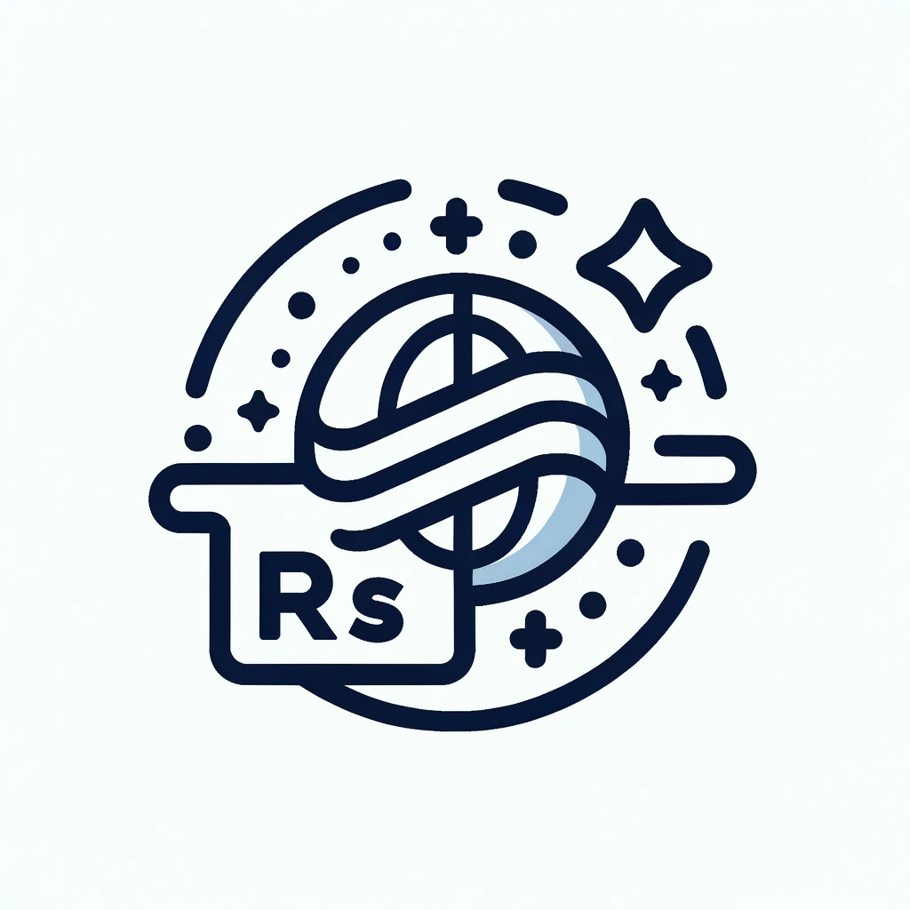

<p align="center">
  
</p>

# Kirby: A Social RSS Platform

## Introduction

Kirby is a platform designed to revolutionize the way we interact with RSS feeds. At its core, it provides functionality for sharing and subscribing to RSS OPML files, opening up a new realm of content discovery. With a vision of becoming a comprehensive RSS reader and social platform, Kirby is stepping towards integrating blockchain technology, intelligent content summarization, and smart notifications.

## Features

- **OPML Sharing and Subscribing**: Any user can upload their RSS OPML files, share with others, and subscribe to other users' shared feeds.
- **Integrated RSS Reader**: An in-built reader to directly engage with the content from subscribed RSS feeds.
- **Blockchain Integration**: Future support for Solana's message distribution applications, enabling user discussions and interactions.
- **Smart Notifications**: An innovative notification system that pushes updates based on users' interests, keeping information overload at bay.
- **Content Summarization**: Integration with GPT for succinct content summaries, aiding in managing information efficiently.
- **Blockchain Network Agnostic Subscriptions**: Support for subscribing to on-chain data from not only Solana but other blockchain networks through an off-chain information transformer, converting on-chain data to RSS-supported link formats.

Based on the workflow diagram and the prior descriptions provided, here's how the README.md could continue from the previous sections:

---

## Workflow

The workflow of Kirby is designed to be user-centric and community-driven, encapsulating the journey from individual RSS feed management to engaging in a blockchain-enhanced discussion forum. The diagram below outlines the step-by-step progression through the platform's features.

```plaintext
+------------------------+     +------------------------+     +------------------------+
| 1. User Registration   |     | 2. Subscription &      |     | 3. Community           |
|    & OPML File Upload  | --> |    Reading             | --> |    Discussion          |
+------------------------+     +------------------------+     +------------------------+
                                      |                             |
                                      v                             v
+------------------------+     +------------------------+     +------------------------+
| 4. Blockchain Messaging|     | 5. Content             |     | 6. On-chain to         |
|    (Future Feature)    |     |    Summarization       |     |    Off-chain Conversion|
+------------------------+     +------------------------+     +------------------------+
```

### 1. User Registration & OPML File Upload

Users start by creating an account and uploading their RSS OPML files. This is the first step towards creating a shared space for content discovery.

### 2. Subscription & Reading

Subscribing to others' shared feeds and utilizing the integrated RSS reader to interact with the content enriches the user's information landscape.

### 3. Community Discussion

Engage with a community of like-minded individuals, discussing topics of interest and creating a social fabric around content.

### 4. Blockchain Messaging (Future Feature)

Integration of blockchain-based messaging, initially targeting Solana's message distribution applications, to enable decentralized discussions.

### 5. Content Summarization

Leveraging GPT to provide succinct summaries of RSS content, helping users cope with information overload.

### 6. On-chain to Off-chain Conversion

A transformation utility to convert on-chain data from various blockchain networks to RSS-supported link formats, enabling subscriptions beyond traditional RSS feeds.
